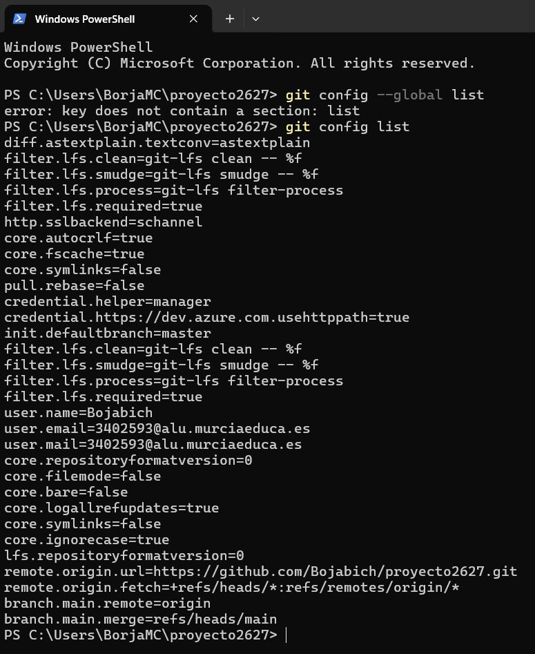
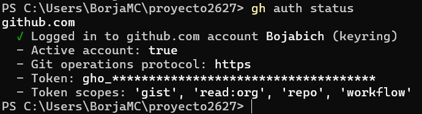
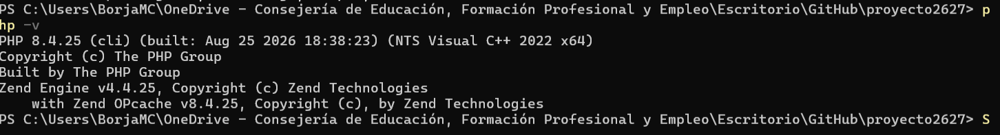
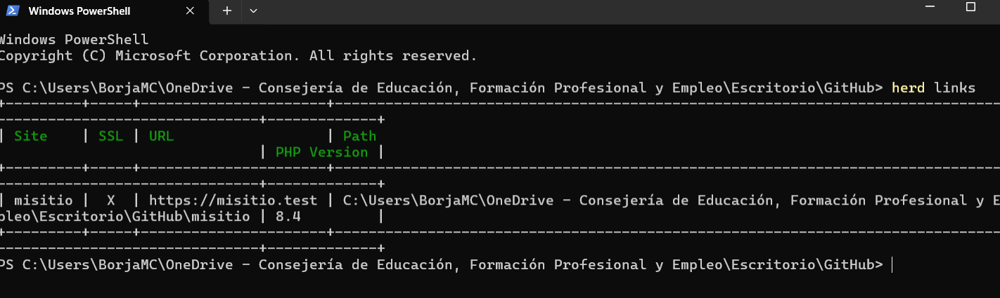
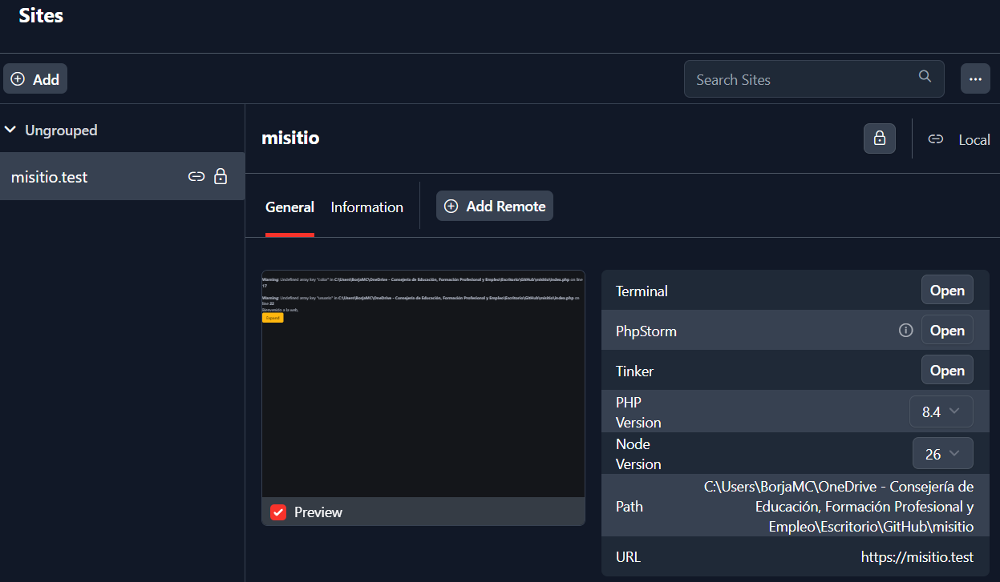

# Instalación y configuración del sitio web local


### 0. Instalar Git

Descargamos Git para Windows desde su página oficial e instalamos la versión de 64 bits. Durante la instalación se pueden mantener las opciones recomendadas.

Comprobamos que Git está disponible:

```powershell
git --version
```


### 1. Configurar Git en local

Indicamos el nombre y el correo que queremos asociar a los nuevos commits. Sustituimos los valores de ejemplo por los nuestros:

```powershell
git config --global user.name "Tu nombre"
git config --global user.email "tu-correo@example.com"
```

Comprobamos la configuración:

```powershell
git config --global --list
```

La salida debe incluir `user.name` y `user.email` con los valores configurados.




---

### 2. Instalar GitHub CLI

Instalamos GitHub CLI (`gh`) desde su página oficial o, en Windows, con el gestor `winget`:

```powershell
winget install --id GitHub.cli
```

Abrimos una nueva terminal y comprobamos la instalación:

```powershell
gh --version
```

---

### 3. Iniciar sesión y comprobar GitHub CLI

Iniciamos el proceso de autenticación con la cuenta de GitHub:

```powershell
gh auth login
```

Elegimos `GitHub.com`, el protocolo HTTPS y la opción de autenticación mediante navegador. Seguimos las indicaciones que aparecen en la terminal y confirmamos el acceso en el navegador.

Verificamos el estado de la sesión:

```powershell
gh auth status
```




---

### 4. Instalar Herd y seleccionar PHP 8.4

Descargamos e instalamos Herd para Windows desde la página oficial de Laravel Herd. Herd proporciona el entorno local para ejecutar PHP y servir el sitio.

En Herd, abrimos **Settings / Preferences → PHP** e instalamos PHP 8.4 si todavía no está disponible. Después seleccionamos **PHP 8.4** como versión global. También se puede seleccionar desde una terminal:

```powershell
herd use 8.4
```

Comprobamos la versión activa:

```powershell
php -v
```




---

### 5. Clonar el repositorio `misitio`

Creamos o elegimos una carpeta para los proyectos y clonamos el repositorio. Sustituimos `USUARIO` por el propietario real del repositorio:

```powershell
Set-Location -Path "$env:USERPROFILE\Herd"
gh repo clone USUARIO/misitio
cd misitio
```

Comprobamos que estamos dentro de la copia local y que Git reconoce el repositorio:

```powershell
Get-Location
git status
```

La ruta actual debe terminar en `Herd\misitio` y `git status` debe mostrar la rama actual y el estado de trabajo.



---

### 6. Enlazar `misitio` a Herd y activar HTTPS

Abrimos Herd y usamos la opción para enlazar un proyecto existente (**Add site / Link existing project**, según la versión de Herd). Seleccionamos la carpeta local `misitio`. Al estar dentro de la carpeta `Herd`, Herd puede reconocerla como sitio local; si el asistente solicita el nombre del sitio, indicamos `misitio`.

Para activar HTTPS, seleccionamos el sitio en Herd y usamos la opción **Secure**. También se puede ejecutar desde la carpeta del proyecto:

```powershell
herd secure misitio
```

Herd asigna el dominio local `https://misitio.test` y prepara el certificado local. Abrimos esa dirección en el navegador y comprobamos que carga la página del sitio y que la conexión utiliza HTTPS.




---

## Resumen: tema Read the Docs y plugins de ProperDocs

La documentación se ha preparado con **ProperDocs**, que transforma páginas Markdown en un sitio web estático a partir de la configuración `properdocs.yml`.

- **Tema `readthedocs`:** organiza el contenido como documentación técnica, con navegación lateral, jerarquía de páginas y controles de navegación entre páginas. En esta práctica se activa además el resaltado de sintaxis para los bloques de código (`highlightjs`) y se declaran PowerShell, Bash y YAML como lenguajes a resaltar.

- **Plugin `search`:** plugin integrado de ProperDocs que crea un índice de búsqueda para encontrar contenido en las páginas. Con la configuración predeterminada, indexa títulos, encabezados y texto completo, lo que permite localizar rápidamente pasos y comandos.
- **Página Markdown (`docs/index.md`):** contiene los pasos, comandos, explicaciones y referencias a las capturas. ProperDocs la convierte en la página principal del sitio.
- **Archivo `properdocs.yml`:** define el título, la navegación, el tema, el resaltado de código y el plugin de búsqueda.

El tema Read the Docs y el plugin `search` son componentes diferentes: el tema controla la presentación y navegación; el plugin añade la búsqueda del contenido. Para instalar ProperDocs junto con el tema elegido y previsualizar la documentación en local:

```powershell
python -m pip install properdocs properdocs-theme-readthedocs
properdocs serve
```

Al iniciar el servidor, ProperDocs muestra la dirección local de previsualización en la terminal.

---

